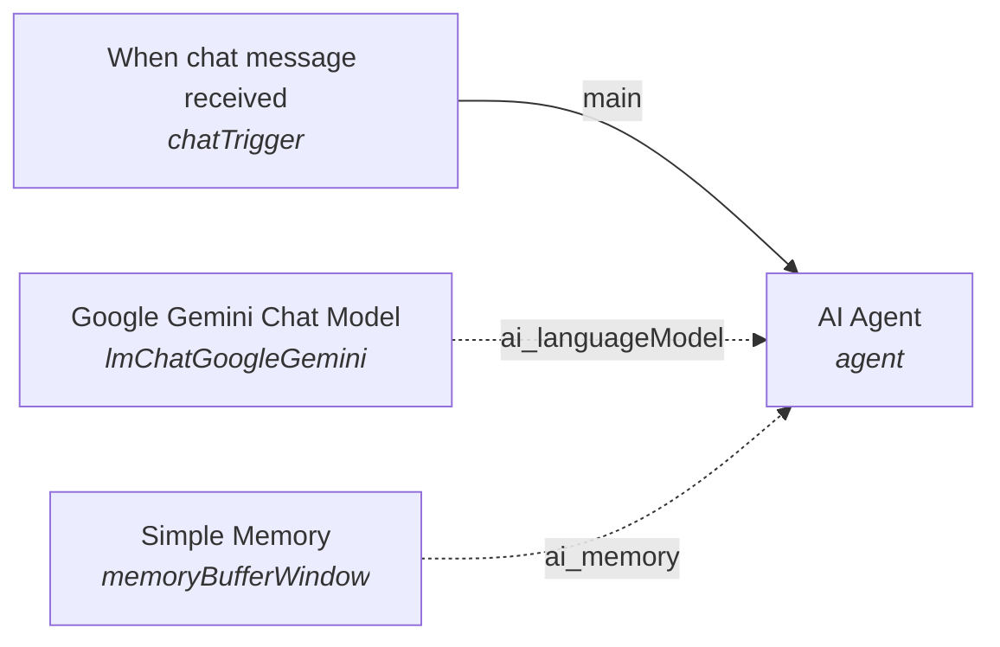

# n8n Workflows

A curated collection of **production-ready [n8n](https://n8n.io) automation workflows**, maintained as plain, portable JSON files that you can import into any n8n instance in seconds.

Every workflow in this repository is committed as a single self-contained `.json` export. No secrets, no environment-specific IDs, and no hard-coded credentials are ever committed — anything sensitive is declared as an n8n **credential** that you attach after import.

---

## Table of contents

- [Available workflows](#available-workflows)
- [Simple Chatbot](#simple-chatbot)
- [Requirements](#requirements)
- [Importing a workflow into n8n](#importing-a-workflow-into-n8n)
  - [Option A — Import from the n8n editor](#option-a--import-from-the-n8n-editor)
  - [Option B — Download the file, then import](#option-b--download-the-file-then-import)
  - [Option C — Headless / CLI import](#option-c--headless--cli-import)
- [Verifying your import](#verifying-your-import)
- [Going to production](#going-to-production)
- [Contributing](#contributing)
- [Disclaimer](#disclaimer)

---

## Available workflows

| # | Workflow | File | Description | Nodes |
|---|----------|------|-------------|-------|
| 1 | **Simple Chatbot** | [`simple_chatbot_workflow.json`](./simple_chatbot_workflow.json) | A conversational AI agent backed by **Google Gemini**, with **LangChain buffer-window memory** for multi-turn context. | 4 |

---

## Simple Chatbot

A drop-in AI chatbot that remembers the conversation. It receives messages from an n8n **Chat Trigger**, passes them to an **AI Agent**, and answers using **Google Gemini** — while a **Simple Memory** node retains the last N messages of context so follow-up questions ("What did I just ask?", "Make it shorter") work as expected.

### Architecture



### Node breakdown

| Node | Type | Type version | Role |
|------|------|---------------|------|
| `When chat message received` | `@n8n/n8n-nodes-langchain.chatTrigger` | 1.4 | Entry point. Opens a chat endpoint and exposes an embeddable widget. |
| `AI Agent` | `@n8n/n8n-nodes-langchain.agent` | 3.1 | Orchestrates the conversation. Receives the user message via `{{ $json.chatInput }}`. |
| `Google Gemini Chat Model` | `@n8n/n8n-nodes-langchain.lmChatGoogleGemini` | 1 | The LLM sub-node. Generates the reply using Google's Gemini models. |
| `Simple Memory` | `@n8n/n8n-nodes-langchain.memoryBufferWindow` | 1.3 | The memory sub-node. Retains a rolling window of recent turns as conversation context. |

The two sub-nodes (model + memory) are attached to the agent through the typed `ai_languageModel` and `ai_memory` connection types rather than the main data line — this is the standard LangChain pattern in n8n, and the connections are already wired in the JSON.

### How it works

1. A user sends a message to the chat endpoint.
2. `When chat message received` emits an item where the message is available as `$json.chatInput`.
3. `AI Agent` reads `{{ $json.chatInput }}` as the prompt.
4. The agent enriches the prompt with prior turns from `Simple Memory`, then calls the Gemini model.
5. The model's reply is returned to the chat widget.

### What you'll need to configure after import

The workflow ships **inactive** (`"active": false`) and credential-free, so the only setup required is:

1. **Attach a Gemini credential.** Open the `Google Gemini Chat Model` node → **Credentials** → create or select a *Google Gemini / Google PaLM* credential (service account JSON or API key). The model will not run without it.
2. **Optionally add a system prompt.** Open `AI Agent` → **Options** to set a persona, tone, or domain guardrails for the assistant.
3. **Tune the memory window.** Open `Simple Memory` and set the context window size if the default isn't right for your use case.
4. **Activate the workflow** (toggle to *Active*) once the above is done.

> **Note:** on import, n8n maps each node to the version available in your instance. If a node reports an unsupported type version, update n8n — the LangChain nodes ship as part of n8n itself.

---

## Requirements

- **n8n Cloud**, or a **self-hosted n8n** instance running a recent `v1.x` release. The LangChain nodes ship with n8n; if you don't see them in the node picker, update your instance.
- A **Google Gemini API key** or **Google Cloud service account** with the Gemini API enabled.
- A browser, for the editor UI. No coding required.

---

## Importing a workflow into n8n

### Option A — Import from the n8n editor

The fastest path, and the one you'll use 95% of the time.

1. Open your n8n instance (e.g. `https://your-instance.n8n.cloud` or `http://localhost:5678`).
2. In the left sidebar, go to **Workflows**.
3. Click the **⋯** menu in the top-right and choose **Import from File**.
   <br>*On older versions: use the **Import from URL** button, or drag the file directly onto the canvas.*
4. Select `simple_chatbot_workflow.json` from your machine.
5. In the import dialog, choose **Create a new workflow**, then click **Import**.
6. The workflow opens on the canvas. Follow [Verifying your import](#verifying-your-import) to attach credentials and test it.

### Option B — Download the file, then import

Fetch the raw JSON directly from GitHub, then import it as in Option A.

**macOS / Linux (curl):**
```bash
curl -L -o simple_chatbot_workflow.json \
  https://raw.githubusercontent.com/ibrahimkamran632/n8n-workflows/main/simple_chatbot_workflow.json
```

**Windows (PowerShell):**
```powershell
Invoke-WebRequest `
  -Uri "https://raw.githubusercontent.com/ibrahimkamran632/n8n-workflows/main/simple_chatbot_workflow.json" `
  -OutFile "simple_chatbot_workflow.json"
```

**Or just copy the URL into n8n's _Import from URL_ field** — no download needed.

### Option C — Headless / CLI import

Useful for provisioning instances from a script or CI pipeline.

```bash
# On a local n8n install
n8n import:workflow --input=./simple_chatbot_workflow.json

# Against a running Docker container
docker cp simple_chatbot_workflow.json <container>:/tmp/
docker exec -it <container> n8n import:workflow --input=/tmp/simple_chatbot_workflow.json
```

**Exporting a workflow back out** (to contribute changes, or for backup):

```bash
n8n export:workflow --id=<WORKFLOW_ID> --output=./simple_chatbot_workflow.json
```

> Credentials are **not** included in exported JSON. If your own workflow embeds secrets, scrub them before committing — see the [Disclaimer](#disclaimer).

---

## Verifying your import

A quick smoke test to confirm everything is wired correctly:

1. Click the **Test Workflow** button in the top bar of n8n.
2. Open the `When chat message received` node and use the chat panel to send a message such as `Hello, who are you?`.
3. Expect a Gemini-generated reply in the chat panel.
4. Now send a follow-up: `What did I just ask you?` — a correct answer confirms `Simple Memory` is supplying context.
5. Check the `AI Agent` node's output to inspect the full response payload.

If step 3 fails, the most common cause is a missing or unselected credential on `Google Gemini Chat Model`.

---

## Going to production

- **Test first.** Always run a manual test before switching a workflow to *Active*.
- **Understand every node.** These workflows are provided as a starting point. Review and adapt the logic to your own use case before running it in production.
- **Keep credentials in n8n's credential store**, never inside the workflow JSON.
- **Mind the webhook URL.** Once activated, the chat endpoint is publicly reachable. Put it behind authentication or a reverse proxy if that matters for your deployment.
- **Monitor executions.** n8n keeps an execution history for every run — use it to debug and to track token usage.

---

## Contributing

Contributions are welcome.

1. Fork this repository and create a branch for your change.
2. Add or update a workflow as a single `.json` file, one workflow per file, named in `snake_case` (e.g. `invoice_slack_notifier.json`).
3. Strip credentials, API keys, tokens, webhook IDs, and any environment-specific paths from the JSON.
4. Add the workflow to the table in [Available workflows](#available-workflows), with a short description.
5. Open a pull request describing what the workflow does and what setup it requires.

**Before you commit, please verify:**

- [ ] The file is valid JSON and imports cleanly into a fresh n8n instance.
- [ ] No secrets, keys, tokens, or customer data are present.
- [ ] All node connections are intact (especially `ai_languageModel` and `ai_memory` links).
- [ ] The workflow is saved with `"active": false`.

---

## Disclaimer

These workflows are provided as-is, for reference and reuse. They are not affiliated with, endorsed by, or supported by n8n GmbH or Google. You are responsible for reviewing, testing, and securing any workflow you deploy, including its compliance with your own data-protection and cost requirements.
